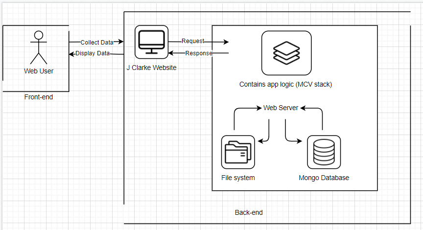

## J Clarke Management Report
[Link to Hosted Website](https://dry-journey-02805.herokuapp.com/)  
[Link to Website GitHub Repoitory](https://github.com/manopanashe/assignment)  

## Introduction
J Clarke is a global retail Company that has over 40 store branches across the world. Its stores are very unique in many ways however the Adminstration for the comapny keeps logs for the store branches based on their numbers and locations and other various information and at the moment these logs are stored into separate CSV files. Due to Covid-19, it has become less efficient for the company to have their store detail logs in these separate file and this has also made the data they need  less accessible for them. To solve this problem i developed a proof of concept Web-application that moves these processes online. 
# System Overview
The J clarke web-application will be a management portal for the company.It provides the adminstration a more effiecent way to keep track of their branches during covid times.The application will contain appropiate tools that will allow them to be able to broadcast important company news or informations and it will also help them to efficiently store and retrieve information about their store branches.  
  
The proposed application will be using The MVC architecture. The architecture separates the application logic into three part Model, Controller and View. As seen in the System Architecture diagram above, the model stores and manages data from the database. The view effectively provides the user interface of the application it contains all of the functionality that directly interacts with the user. The controller connects the new and the model. it converts user input from the view  into to demands for the model to  retieve or update data.  

The application will use a Non-relational database through mongoDB which is a document-based database that stores data in JSON-like documents. The database uses an existing dataset from the from the company which were previously stored in three CSV documents. As seen in the image above the files  were then converted into three collections and stored under one database. 
 
as seen in the image above mongo then converts the data in the files into database objects which can then be aceesed by the Model. 

 allow the Company Managers to be able to peform Node CRUD functions that will be applied to a mongoDB database .MongoDB is a document based 

 and also the store branches managers. The store managers should be able to Create, Read,Update, Delete store logs into a dataset that contains the previuos logs. 